# Graphs of benchmark-2 performance test

## 1. CPU and Memory

* baseline

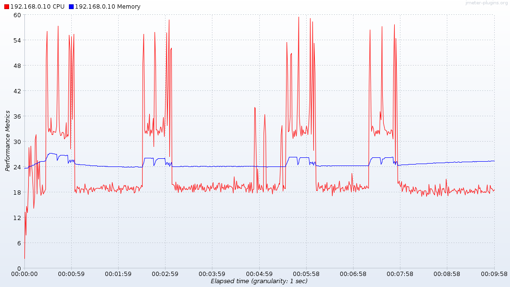

* eBPF-mode agent

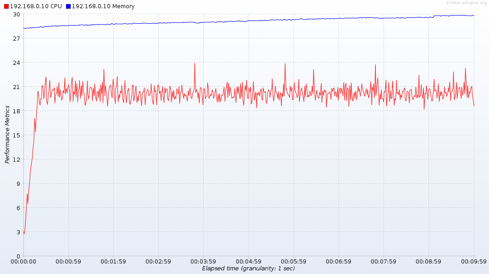

* kernel-mode agent

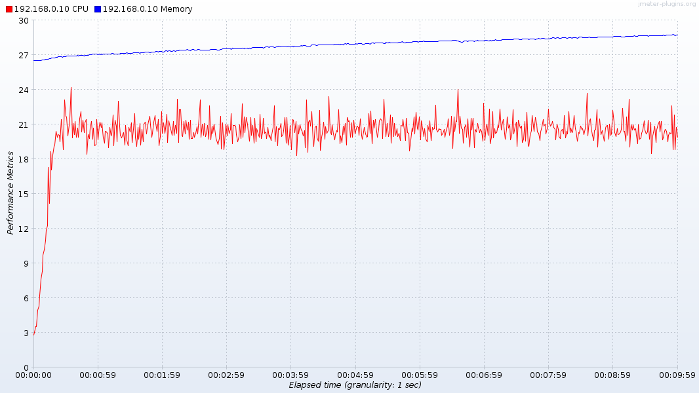

## 2. TransactionPerSecond

* baseline

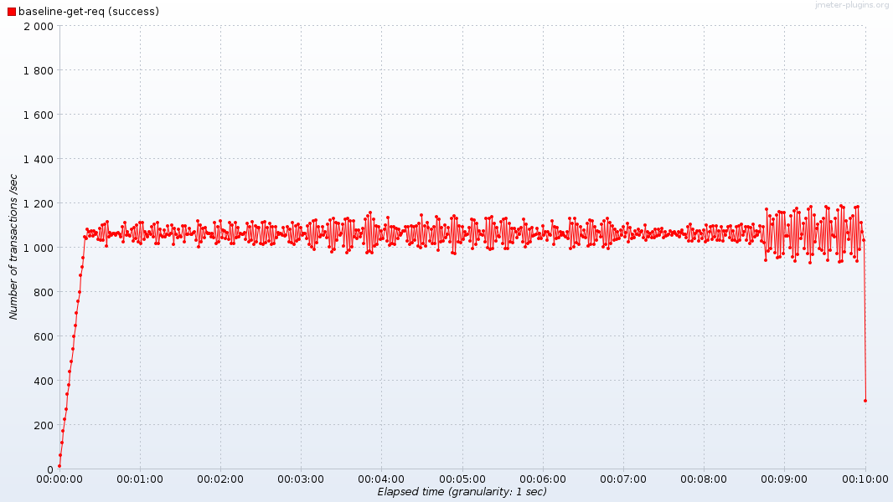

* eBPF-mode agent

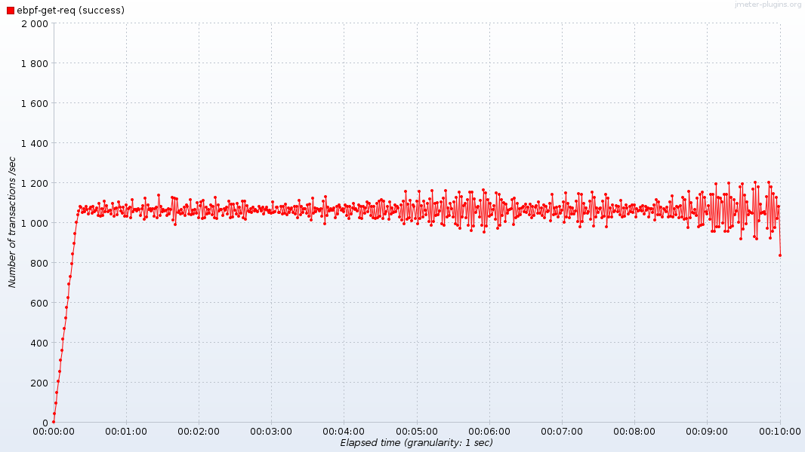

* kernel-mode agent

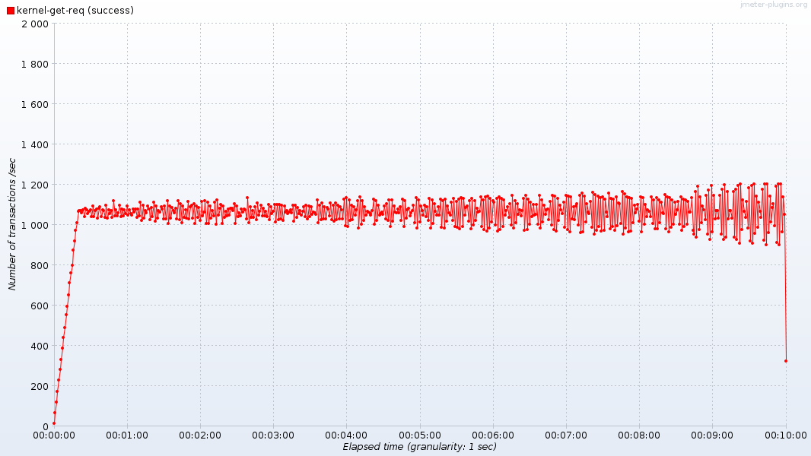

## 3. ReponseTimesOverTime

* baseline

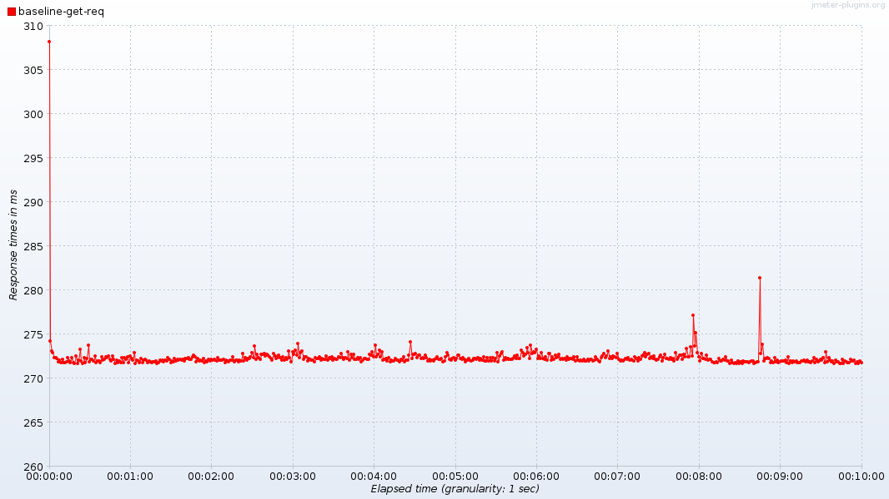

* eBPF-mode agent
  
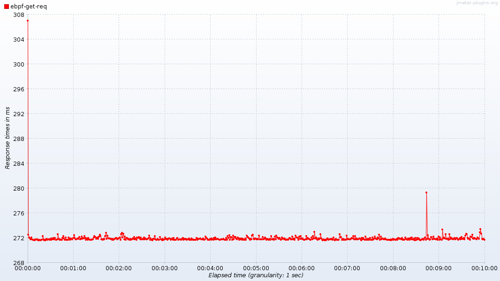

* kernel-mode agent

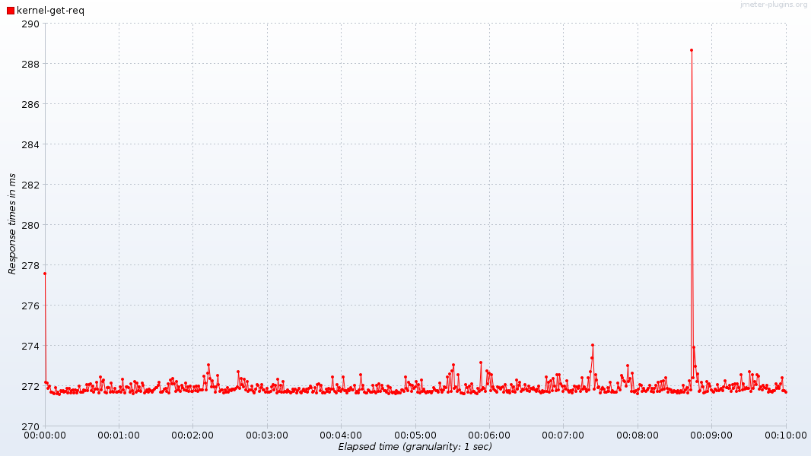

## 4. applicationCPU

* baseline

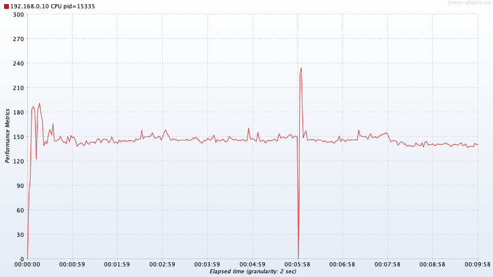

* eBPF-mode agent

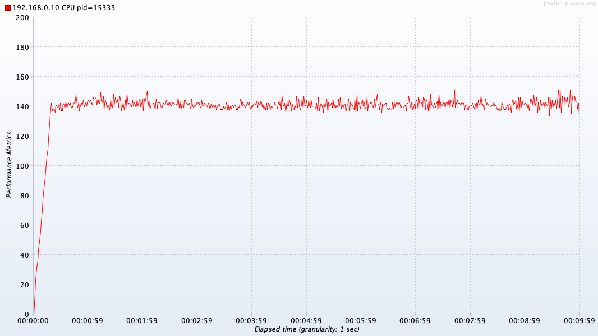

* kernel-mode agent

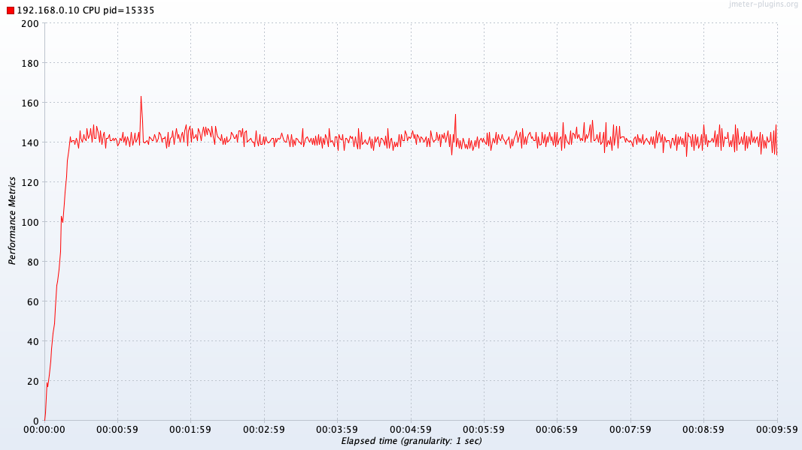

